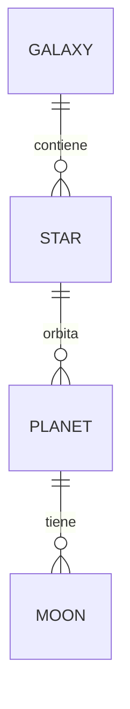

# Universe Database - freeCodeCamp Certification

Este proyecto es parte del currículo de **Relational Database** de freeCodeCamp. El objetivo principal fue diseñar y poblar una base de datos relacional utilizando **PostgreSQL** para representar diversos elementos del universo conocido.

## 🚀 Características del Proyecto

La base de datos se llama `universe` y contiene una estructura jerárquica que conecta galaxias con sus respectivos sistemas y lunas.

### Estructura de la Base de Datos:
* **Galaxy**: Información sobre diferentes galaxias (espirales, elípticas, etc.).
* **Star**: Estrellas vinculadas a una galaxia específica.
* **Planet**: Planetas que orbitan dichas estrellas.
* **Moon**: Satélites naturales asociados a cada planeta.
* **Galaxy Types**: Una tabla adicional para categorizar la morfología galáctica.

## 📐 Estructura y Relaciones (DER)



## 🛠️ Detalles Técnicos

* **Motor de Base de Datos:** PostgreSQL.
* **Relaciones:** Implementación de llaves primarias (`PRIMARY KEY`) y llaves foráneas (`FOREIGN KEY`) para mantener la integridad referencial.
* **Tipos de Datos:** Uso de `INT`, `NUMERIC`, `TEXT`, `VARCHAR` y `BOOLEAN`.
* **Restricciones:** Uso de `UNIQUE`, `NOT NULL` y autoincrementos (`SERIAL`).

## 📊 Estadísticas de la Base de Datos

Para cumplir con los requisitos de la certificación, la base de datos incluye:
- **6** Galaxias.
- **6** Estrellas.
- **12** Planetas.
- **20** Lunas.

## 🛠️ Conceptos Demostrados

* **Normalización y Claves Foráneas**: Garantía de integridad referencial entre entidades jerárquicas (Galaxia ➔ Estrella ➔ Planeta ➔ Luna).
* **Restricciones de Integridad** (Constraints): Uso estricto de NOT NULL, UNIQUE, y tipos de datos adecuados (Enteros, Cadenas, Booleanos, Flotantes/Numéricos).
* **Script DDL & DML**: Creación estructurada de tablas e inserción inicial de datos lista para su ejecución.

## ⚙️ Cómo reconstruir la base de datos

Si deseas replicar este proyecto localmente, asegúrate de tener PostgreSQL instalado y sigue estos pasos:

1. Crea la base de datos:
   ```bash
   createdb universe
2. Importa el archivo SQL:
```
   psql universe < universe.sql
```

## 🔍 Consultas de Ejemplo (Queries)
```SQL
   -- Obtener todos los planetas con el nombre de su estrella y galaxia correspondiente
   SELECT 
       planet.name AS planeta, 
       star.name AS estrella, 
       galaxy.name AS galaxia
   FROM planet
   JOIN star ON planet.star_id = star.star_id
   JOIN galaxy ON star.galaxy_id = galaxy.galaxy_id;
```

---

## 📜 Créditos y Reconocimientos

* **Origen de la consigna / dataset:** Este proyecto es uno de los desafíos requeridos para la obtención de la **Certificación de Bases de Datos Relacionales** de [freeCodeCamp](https://www.freecodecamp.org/).
* **Implementación:** La lógica de scripts en Bash (`insert_data.sh`), la estructuración del esquema PostgreSQL (`worldcup.sql`) y la elaboración de consultas analíticas (`queries.sh`) fueron desarrolladas por completo como resolución individual al problema planteado.

